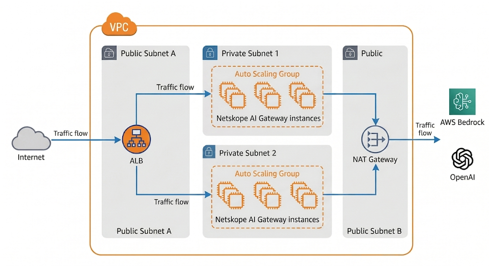

# Netskope AI Gateway — Auto Scaling Deployment

## Overview

This CloudFormation template (`templates/gateway-asg.yaml`) deploys two services:

**AI Gateway Service** — An Auto Scaling Group of Netskope AI Gateway instances behind an internet-facing Application Load Balancer. Each instance is automatically enrolled with the Netskope tenant, configured for DLP inspection, and placed into service — no manual setup required. The ASG scales independently based on capacity parameters.

**DLP On Demand Service (Optional)** — When `DlpodAmiId` is provided, a second Auto Scaling Group of DLP On Demand (DLPoD) appliances is deployed behind a private internal ALB with a Route 53 private hosted zone (`dlp.aigw.internal`). Each DLPoD instance is automatically tethered to the Netskope management plane via lifecycle hooks. The AI Gateway instances are configured to forward content to the DLPoD service for inline DLP inspection.

Both services use the same lifecycle automation pattern: ASG lifecycle hooks trigger Lambda functions that orchestrate configuration via Step Functions. TLS certificates for both ALBs are automatically generated at stack creation. Each service scales independently through its own ASG.

This repository includes a `CLAUDE.md` file that provides [Claude Code](https://docs.anthropic.com/en/docs/claude-code) with full project context. Claude Code can assist with deploying stacks, reading logs, diagnosing enrollment failures, and managing scaling operations. See [TROUBLESHOOTING.md](docs/TROUBLESHOOTING.md) for usage examples.



---

## Prerequisites

Before deploying, ensure the following are in place.

### 1. Netskope AI Gateway AMI

The AI Gateway is deployed from a shared AMI provided by Netskope. This AMI must be available in your target AWS account and region.

- The AI Gateway AMI is currently distributed by Netskope directly. Contact your Netskope representative to have the AMI shared with your AWS account. This distribution method may change in the future (e.g., AWS Marketplace availability).
- If the AMI has been shared to a different region, copy it to your target region using `aws ec2 copy-image`.
- The AMI includes the AI Gateway appliance services (VAM, DMS, traffic intercept, ext-authz, RLS), SSH support for Lambda automation, and all required dependencies.
- Pass the AMI ID as the `GatewayAmiId` parameter when deploying.

### 2. Netskope Tenant Credentials

You need:
- **Tenant URL** — Your Netskope tenant URL (e.g., `https://tenant.goskope.com`). Do not include `/api/v2` — the template appends the API path automatically.
- **API Token** — An RBAC v3 service account token with permissions to manage AI Gateway appliances.

These credentials are stored in AWS Secrets Manager by the template and are never exposed to the gateway instances.

#### Generating an RBAC v3 Service Account Token

Netskope RBAC v3 is the current mandatory access control model. It uses service accounts with role-based permissions for API access, replacing the legacy REST API v2 token model.

1. **Create a Role** — In your Netskope tenant, navigate to **Settings > Administration > Administrators & Roles > Roles** and click **New**. Assign the permissions required for AI Gateway management (On-Premises Infrastructure). Save the role.

2. **Create a Service Account** — Navigate to **Settings > Administration > Administrators & Roles > Administrators**. Click **Add** and select **Service Account**. Assign the role created in step 1 and click **Create**.

3. **Copy the Token** — The token is displayed only once after creation. Copy it immediately and store it securely. This is the value you pass as the `NetskopeApiToken` parameter.

> **Note:** Existing REST API v2 tokens (`Settings > Tools > REST API v2`) continue to work until expiry but cannot be renewed. New deployments should use RBAC v3 service accounts. If a token is lost, it can be regenerated from the service account settings.

For more information, see:
- [Netskope RBAC V3 Overview](https://docs.netskope.com/en/netskope-rbac-v3-overview/)
- [Administrators RBAC V3](https://docs.netskope.com/en/administrators-rbac-v3/)
- [Service Account Migration](https://docs.netskope.com/en/service-account-migration-and-netskope-client-auditing/)

### 3. TLS Certificates (Automatic)

TLS certificates for both the gateway ALB and DLPoD ALB are automatically generated at stack creation by a shared cert generator Lambda. The gateway ALB certificate uses the `GatewayAlbDomainName` parameter as the Common Name (default: `aigw.internal`). No manual certificate creation is required. See [CERTIFICATE_MANAGEMENT.md](docs/CERTIFICATE_MANAGEMENT.md) for details.

### 4. Lambda Deployment Artifacts

The enrollment Lambda and its Layer must be built and uploaded to an S3 bucket in the deployment region. A script is provided that handles bucket creation, builds, and uploads:

```bash
scripts/deploy-artifacts.sh us-west-1
```

See [DEPLOYMENT.md](docs/DEPLOYMENT.md) for manual steps and update procedures.

### 5. DLPoD (Optional)

If you want DLP content inspection, provide a DLPoD AMI ID (`DlpodAmiId`) and license key (`DlpodLicenseKey`) when deploying. The template conditionally deploys DLPoD as part of the stack — no separate deployment is needed.

To obtain these:
- **DLPoD AMI** — The DLPoD AMI is available in the [AWS Marketplace](https://aws.amazon.com/marketplace). Search for "Netskope DLP On Demand" and subscribe. After subscribing, the AMI will be available in your account for the subscribed regions.
- **License Key** — In your Netskope tenant, navigate to **Settings > Security Cloud Platform > On-Premises Infrastructure** to generate or retrieve a DLPoD license key.

### 6. AWS Services and IAM Permissions

The template creates resources across the following AWS services:

| Service | Resources Created |
|---------|------------------|
| **EC2** | Launch Template, Security Groups, VPC (optional), Subnets (optional), VPC Endpoints (optional) |
| **Auto Scaling** | Auto Scaling Group, Lifecycle Hooks |
| **Elastic Load Balancing** | Application Load Balancer, Target Group, HTTPS Listener |
| **Lambda** | 3-4 Functions (activation, enrollment, cert generator, DLPoD tethering when enabled), Layer, Permissions |
| **Step Functions** | 1-2 State Machines (enrollment orchestration, DLPoD tethering when enabled) |
| **IAM** | Roles (gateway, activation Lambda, enrollment Lambda, Step Functions, lifecycle SNS, cert generator, DLPoD when enabled), Instance Profiles |
| **Secrets Manager** | 2 Secrets (Netskope credentials, SSH private key) |
| **Route 53** | Private hosted zone for DLPoD ALB (when DLPoD enabled) |
| **SNS** | Topic, Subscription |
| **CloudWatch Logs** | Log Group (Lambda) |

The IAM principal deploying the stack needs the permissions listed below. The stack uses `CAPABILITY_NAMED_IAM` because it creates IAM roles with explicit names.

You can create a dedicated IAM role with this policy and assume it before deploying. See the AWS documentation for:
- [Creating IAM roles](https://docs.aws.amazon.com/IAM/latest/UserGuide/id_roles_create.html)
- [Assuming a role with the AWS CLI](https://docs.aws.amazon.com/cli/latest/userguide/cli-configure-role.html)

<details>
<summary>IAM policy JSON (click to expand)</summary>

```json
{
  "Version": "2012-10-17",
  "Statement": [
    {
      "Sid": "CloudFormation",
      "Effect": "Allow",
      "Action": "cloudformation:*",
      "Resource": "*"
    },
    {
      "Sid": "EC2",
      "Effect": "Allow",
      "Action": "ec2:*",
      "Resource": "*"
    },
    {
      "Sid": "ELB",
      "Effect": "Allow",
      "Action": "elasticloadbalancing:*",
      "Resource": "*"
    },
    {
      "Sid": "AutoScaling",
      "Effect": "Allow",
      "Action": "autoscaling:*",
      "Resource": "*"
    },
    {
      "Sid": "Lambda",
      "Effect": "Allow",
      "Action": "lambda:*",
      "Resource": "*"
    },
    {
      "Sid": "IAM",
      "Effect": "Allow",
      "Action": [
        "iam:CreateRole",
        "iam:DeleteRole",
        "iam:GetRole",
        "iam:PutRolePolicy",
        "iam:DeleteRolePolicy",
        "iam:AttachRolePolicy",
        "iam:DetachRolePolicy",
        "iam:PassRole",
        "iam:TagRole",
        "iam:UntagRole",
        "iam:CreateInstanceProfile",
        "iam:DeleteInstanceProfile",
        "iam:GetInstanceProfile",
        "iam:AddRoleToInstanceProfile",
        "iam:RemoveRoleFromInstanceProfile"
      ],
      "Resource": "*"
    },
    {
      "Sid": "SecretsManager",
      "Effect": "Allow",
      "Action": [
        "secretsmanager:CreateSecret",
        "secretsmanager:DeleteSecret",
        "secretsmanager:DescribeSecret",
        "secretsmanager:TagResource"
      ],
      "Resource": "*"
    },
    {
      "Sid": "StepFunctions",
      "Effect": "Allow",
      "Action": [
        "states:CreateStateMachine",
        "states:DeleteStateMachine",
        "states:UpdateStateMachine",
        "states:DescribeStateMachine",
        "states:TagResource"
      ],
      "Resource": "*"
    },
    {
      "Sid": "SNS",
      "Effect": "Allow",
      "Action": [
        "sns:CreateTopic",
        "sns:DeleteTopic",
        "sns:Subscribe",
        "sns:Unsubscribe",
        "sns:GetTopicAttributes",
        "sns:SetTopicAttributes",
        "sns:TagResource"
      ],
      "Resource": "*"
    },
    {
      "Sid": "CloudWatchLogs",
      "Effect": "Allow",
      "Action": [
        "logs:CreateLogGroup",
        "logs:DeleteLogGroup",
        "logs:DescribeLogGroups",
        "logs:PutRetentionPolicy",
        "logs:TagResource"
      ],
      "Resource": "*"
    },
    {
      "Sid": "S3TemplateAccess",
      "Effect": "Allow",
      "Action": "s3:GetObject",
      "Resource": "arn:aws:s3:::netskope-aigw-templates-*/*"
    },
    {
      "Sid": "ACM",
      "Effect": "Allow",
      "Action": [
        "acm:DescribeCertificate",
        "acm:ListCertificates"
      ],
      "Resource": "*"
    }
  ]
}
```

</details>

---

## Upload Lambda Artifacts to S3

The Lambda packages, Layer, and template must be uploaded to an S3 bucket before deployment. The template exceeds 51KB and must be deployed via `--template-url` from S3.

Use the provided script to create the bucket, build, and upload:

```bash
scripts/deploy-artifacts.sh us-west-1
```

Or manually:

```bash
ACCOUNT_ID=$(aws sts get-caller-identity --query Account --output text)
REGION=us-west-1
BUCKET="netskope-aigw-templates-${ACCOUNT_ID}"

aws s3 mb "s3://${BUCKET}" --region "${REGION}"

bash scripts/build-activation-lambda.sh
bash scripts/build-step-function-lambda.sh
# Build Layer (requires Docker/Podman):
podman run --rm --platform linux/amd64 --entrypoint bash \
  -v "$PWD/scripts:/build" -w /build \
  public.ecr.aws/lambda/python:3.12 ./build-tui-layer.sh

aws s3 cp templates/gateway-asg.yaml "s3://${BUCKET}/templates/gateway-asg.yaml"
aws s3 cp scripts/lambda-activation.zip "s3://${BUCKET}/lambda-activation.zip"
aws s3 cp scripts/lambda-step-function.zip "s3://${BUCKET}/lambda-step-function.zip"
aws s3 cp scripts/pexpect-layer.zip "s3://${BUCKET}/layers/pexpect-layer.zip"
```

### Bucket layout

```
s3://<bucket>/
  templates/
    gateway-asg.yaml          # CloudFormation template (>51 KB)
  lambda-activation.zip       # Activation Lambda package (~4 KB)
  lambda-step-function.zip    # Enrollment Lambda package (~20 KB)
  layers/
    pexpect-layer.zip         # paramiko/pyte Lambda Layer (~10 MB)
```

The bucket must be in the **same region** as the stack. It does not need to be public — CloudFormation fetches using the caller's IAM credentials.

---

## Deployment Planning

Before deploying, decide on these three options:

### New VPC or Existing VPC?

- **New VPC** (recommended for evaluation) — Leave all `Existing*` parameters empty. The template creates a VPC with public and private subnets, internet gateway, NAT gateway, route tables, and all required VPC endpoints. No network prerequisites.
- **Existing VPC** — Provide the VPC ID and four subnet IDs (2 public for ALB, 2 private for instances). Requires a NAT gateway, DNS enabled, and no conflicting VPC endpoints. See [VPC Requirements](docs/DEVOPS.md#when-using-an-existing-vpc) for the full checklist.

### With DLPoD or Without?

- **Without DLPoD** — Gateway only, no inline DLP content inspection. Suitable when DLP is handled by another service or not needed. Leave `DlpodAmiId` empty.
- **With DLPoD** — Adds a second Auto Scaling Group, private ALB, and Route 53 hosted zone for DLP inspection. Requires:
  - DLPoD AMI from the [AWS Marketplace](https://aws.amazon.com/marketplace) (search "Netskope DLP On Demand")
  - License key from your Netskope tenant (**Settings > Security Cloud Platform > On-Premises Infrastructure**)

### Instance Type?

- **m5.4xlarge** (default) — CPU-only, supports standard AI guardrails. Sufficient for most deployments.
- **GPU instances** (g4dn, g5) — Required for advanced AI guardrails that use CUDA/NVIDIA acceleration. You must update the `AllowedValues` constraint in the template to permit GPU instance types.

---

## Deployment

### Deploy with an existing VPC

```bash
aws cloudformation create-stack \
  --stack-name my-aigw \
  --template-url "https://${BUCKET}.s3.${REGION}.amazonaws.com/templates/gateway-asg.yaml" \
  --parameters \
    ParameterKey=ExistingVpcId,ParameterValue=vpc-xxxxxxxxx \
    ParameterKey=ExistingPublicSubnetId,ParameterValue=subnet-pub1 \
    ParameterKey=ExistingPublicSubnet2Id,ParameterValue=subnet-pub2 \
    ParameterKey=ExistingPrivateSubnetId,ParameterValue=subnet-priv1 \
    ParameterKey=ExistingPrivateSubnet2Id,ParameterValue=subnet-priv2 \
    ParameterKey=NetskopeTenantUrl,ParameterValue=https://tenant.goskope.com \
    ParameterKey=NetskopeApiToken,ParameterValue=<token> \
    ParameterKey=LambdaCodeBucket,ParameterValue=${BUCKET} \
  --capabilities CAPABILITY_NAMED_IAM
```

When using an existing VPC, review the [VPC Requirements](#vpc-requirements-existing-vpc) section to ensure your network is correctly configured.

### Deploy with DLPoD

To include DLP content inspection, add the DLPoD parameters:

```bash
aws cloudformation create-stack \
  --stack-name my-aigw \
  --template-url "https://${BUCKET}.s3.${REGION}.amazonaws.com/templates/gateway-asg.yaml" \
  --parameters \
    ParameterKey=NetskopeTenantUrl,ParameterValue=https://tenant.goskope.com \
    ParameterKey=NetskopeApiToken,ParameterValue=<token> \
    ParameterKey=GatewayAmiId,ParameterValue=<gateway-ami-id> \
    ParameterKey=DlpodAmiId,ParameterValue=<dlpod-ami-id> \
    ParameterKey=DlpodLicenseKey,ParameterValue=<license-key> \
    ParameterKey=LambdaCodeBucket,ParameterValue=${BUCKET} \
  --capabilities CAPABILITY_NAMED_IAM
```

### Deploy with a new VPC

Omit all `Existing*` parameters (or set them to empty strings). The template creates a VPC with public subnets, private subnets, an internet gateway, a NAT gateway, route tables, and all required VPC endpoints.

### Outputs

After deployment, the stack provides these outputs:

| Output | Description |
|--------|-------------|
| `ALBDnsName` | ALB DNS name — point your DNS (Route 53 CNAME or alias) to this |
| `ALBHostedZoneId` | ALB canonical hosted zone ID (for Route 53 alias records) |
| `AutoScalingGroupName` | ASG name for scaling operations |
| `VpcId` | VPC ID (created or existing) |
| `PublicSubnetId` | Subnet 1 ID (created or existing) |
| `GatewaySecurityGroupId` | Gateway security group ID |

---

## Stack Parameters

### Netskope Tenant Configuration

| Parameter | Required | Description |
|-----------|----------|-------------|
| `NetskopeTenantUrl` | Yes | Netskope tenant URL (e.g., `https://tenant.goskope.com`). Do not include the API path. |
| `NetskopeApiToken` | Yes | API token for appliance registration. Stored in Secrets Manager (NoEcho). |

### Network Configuration

The template uses a split-subnet architecture: **public subnets** for the ALB and **private subnets** for the gateway instances. The private subnets route outbound traffic through a NAT gateway.

**Option A: Create a new VPC** — Leave all `Existing*` parameters empty. The template creates a VPC with public subnets, private subnets, an internet gateway, a NAT gateway, route tables, and all required VPC endpoints.

**Option B: Use an existing VPC** — Provide the VPC ID, two public subnet IDs (for the ALB), and two private subnet IDs (for the instances). The template creates only the security groups and deploys into your existing network. See [VPC Requirements](#vpc-requirements-existing-vpc).

| Parameter | Required | Description |
|-----------|----------|-------------|
| `ExistingVpcId` | No | Existing VPC ID. Empty creates a new VPC. |
| `ExistingPublicSubnetId` | No | Existing public subnet for ALB (AZ 1). Empty creates new. |
| `ExistingPublicSubnet2Id` | No | Existing public subnet for ALB (AZ 2). Empty creates new. |
| `ExistingPrivateSubnetId` | No | Existing private subnet for instances (AZ 1). Empty creates new. |
| `ExistingPrivateSubnet2Id` | No | Existing private subnet for instances (AZ 2). Empty creates new. |
| `VpcCidr` | No | CIDR for new VPC (ignored when using existing). |
| `PublicSubnetCidr` | No | CIDR for new public subnet 1. |
| `PublicSubnet2Cidr` | No | CIDR for new public subnet 2. |
| `PrivateSubnetCidr` | No | CIDR for new private subnet 1. |
| `PrivateSubnet2Cidr` | No | CIDR for new private subnet 2. |

### Gateway Instance Configuration

| Parameter | Required | Description |
|-----------|----------|-------------|
| `GatewayAmiId` | Yes | Netskope AI Gateway AMI ID. Obtain from your Netskope representative. |
| `InstanceType` | No | Instance type. Minimum 16 vCPU, 64 GiB RAM. Allowed: m5.4xlarge, m6i.4xlarge, c5.4xlarge. |
| `LambdaCodeBucket` | Yes | S3 bucket containing Lambda package and Layer. |
| `LambdaCodeKey` | No | S3 key for enrollment Lambda (default: `lambda-step-function.zip`). |
| `LambdaLayerKey` | No | S3 key for paramiko/pyte Layer (default: `layers/pexpect-layer.zip`). |

> **Note:** Advanced AI guardrails (beyond basic policy enforcement) require a CUDA-capable NVIDIA GPU. If advanced guardrails are needed, use GPU instance types (e.g., g4dn.4xlarge, g5.4xlarge) and update the `AllowedValues` constraint in the template.

### Load Balancer Configuration

| Parameter | Required | Description |
|-----------|----------|-------------|
| `GatewayAlbDomainName` | No | Common Name for the auto-generated gateway ALB certificate (default: `aigw.internal`). |

### Auto Scaling Configuration

| Parameter | Required | Description |
|-----------|----------|-------------|
| `MinCapacity` | No | Minimum number of gateway instances. |
| `MaxCapacity` | No | Maximum number of gateway instances. |
| `DesiredCapacity` | No | Initial number of gateway instances. |

### DLPoD Configuration

All DLPoD parameters are optional. Leave `DlpodAmiId` empty to skip DLPoD deployment entirely.

| Parameter | Required | Description |
|-----------|----------|-------------|
| `DlpodAmiId` | No | DLPoD AMI ID. Leave empty to skip DLPoD deployment. |
| `DlpodInstanceType` | No | DLPoD instance type (default: `c5a.4xlarge`). Must be c5a or c5ad family. |
| `DlpodLicenseKey` | No | DLPoD license key from Netskope tenant (NoEcho). Required when `DlpodAmiId` is provided. |
| `DlpodLambdaCodeKey` | No | S3 key for DLPoD Lambda package (default: `lambda-dlpod.zip`). |
| `DlpDomainName` | No | FQDN for the DLPoD private ALB (default: `dlp.aigw.internal`). Resolved via Route 53 private hosted zone. |
| `DnsServer` | No | DNS server IP for DLPoD configuration. Leave empty if not required. |
| `DlpodMinCapacity` | No | Minimum number of DLPoD instances (default: `1`). |
| `DlpodMaxCapacity` | No | Maximum number of DLPoD instances (default: `1`). |
| `DlpodDesiredCapacity` | No | Desired number of DLPoD instances (default: `1`). |

### Tagging

| Parameter | Required | Description |
|-----------|----------|-------------|
| `Project` | No | Project name applied as a tag to all resources. |
| `Environment` | No | Environment tag (dev, staging, prod). |

---

## VPC Requirements (Existing VPC)

When deploying into an existing VPC, you are responsible for ensuring the VPC meets the following requirements. The template does not validate these at deployment time — failures will manifest as VPC endpoint connectivity issues or Lambda timeouts.

### Subnets

The template requires **four subnets** — two public and two private, each pair in different availability zones.

**Public subnets** (for the ALB):
- Must have a route to an internet gateway (the ALB is internet-facing).
- Two subnets in different AZs are required (ALB multi-AZ requirement).
- These subnets only host the ALB ENIs, not the gateway instances.

**Private subnets** (for the gateway instances):
- Must have a route to a NAT gateway for outbound internet access (to reach the Netskope tenant API and LLM providers).
- The ALB routes to instances using their private IPs — instances do not need public IPs.
- Two subnets in different AZs ensure multi-AZ instance placement.
- VPC endpoints (see below) can reduce dependency on the NAT gateway for AWS service calls.

### VPC Endpoints and NAT Gateway

The Enrollment Lambda runs in the VPC private subnets and needs access to:

| Service | Access method | Purpose |
|---------|--------------|---------|
| Secrets Manager | VPC endpoint (created by template) | Read SSH private key |
| ASG / Step Functions APIs | NAT gateway | Complete lifecycle action, AWS API calls |
| Gateway instances (SSH) | Direct VPC connectivity | TUI enrollment over port 22 |

The private subnets **must have a NAT gateway** for outbound internet access. The gateway instances also require NAT for Netskope policy updates and LLM provider connectivity.

The template creates a Secrets Manager VPC endpoint in all deployments. An S3 gateway endpoint is created when deploying a new VPC.

### DNS Resolution

- The VPC must have **DNS support** and **DNS hostnames** enabled (`EnableDnsSupport: true`, `EnableDnsHostnames: true`).
- The Secrets Manager VPC endpoint must have **Private DNS enabled** so the Lambda can resolve `secretsmanager.<region>.amazonaws.com` to the endpoint's private IP.

### DLPoD Network Connectivity

When DLPoD is deployed (`DlpodAmiId` is provided), it runs in the same VPC and private subnets as the AI Gateway instances. A private ALB fronts the DLPoD ASG, and a Route 53 private hosted zone resolves `DlpDomainName` (default: `dlp.aigw.internal`) to the private ALB. No additional VPC peering or network configuration is needed — the template handles all security group rules, ALB configuration, and DNS resolution.

---

## About the Netskope AI Gateway

### What It Does

The Netskope AI Gateway is a software appliance that intercepts and secures traffic between AI agents, applications, and LLMs. It sits inline on the request/response path and provides:

- **Data Loss Prevention (DLP)** — Monitors prompts and responses for sensitive data (PII, credentials, proprietary content) and blocks or redacts as configured by policy.
- **Content Moderation** — AI guardrail protection that detects and blocks prompt injection attacks, inappropriate content, and policy-violating interactions.
- **Authentication** — Manages secure access to LLMs through token-based authentication, ensuring only authorized applications and users can reach models.
- **Rate Limiting** — Controls the volume of requests per consumer to prevent abuse, manage costs, and ensure fair resource allocation.
- **Monitoring and Compliance** — Logs all AI interactions for audit trails, tracks usage patterns, and ensures interactions meet corporate governance standards.
- **Unified API** — Provides a single, consistent API interface (OpenAI-compatible) for interacting with multiple AI model providers, simplifying application integration.

Applications send requests to the AI Gateway instead of directly to the LLM provider. The gateway inspects the request, applies security policies, forwards permitted requests to the model, inspects the response, and returns it to the application. Blocked or non-compliant requests receive a policy-defined response without reaching the model.

### How DLP On Demand (DLPoD) Integrates

The AI Gateway can optionally integrate with a **Netskope DLP On Demand (DLPoD)** appliance for deep content inspection. DLPoD provides local, collocated document and text scanning via a REST API, supporting both structured and unstructured content analysis including text extracted from LLM prompts and responses. Data does not leave your VPC for DLP scanning.

When `DlpodAmiId` is provided, the template conditionally deploys DLPoD as part of the stack. DLPoD runs in its own Auto Scaling Group behind a private ALB, with a Route 53 private hosted zone (`dlp.aigw.internal` by default) for DNS resolution. Each DLPoD instance is automatically tethered to the Netskope management plane using the same lifecycle hook pattern as the AI Gateway:

1. **DLPoD ASG launches instance** -- lifecycle hook holds it in `Pending:Wait`
2. **Activation Lambda** receives the lifecycle event and starts a DLPoD tethering Step Functions execution
3. **Step Functions** orchestrates tethering via the DLPoD Lambda: sets the admin password, configures DNS, applies the license key, and polls until tethering completes
4. Instance moves to `InService`

The AI Gateway is automatically configured to use the DLPoD service after its own enrollment completes. The AIG enrollment state machine waits for the DLPoD TLS certificate to appear in SSM Parameter Store, then navigates the AIG TUI to configure the DLP service certificate and host URL (`DlpDomainName`).

---

## Glossary

Terms used throughout this documentation:

| Term | Definition |
|------|-----------|
| **Appliance ID** | Unique identifier assigned when a gateway registers with the Netskope tenant API. Stored in SSM Parameter Store (`/aig/{stack}/{instance-id}/appliance-id`); used for deregistration when an instance is terminated. |
| **Enrollment token** | One-time token generated by the Netskope API during appliance registration. Passed to the gateway over SSH during TUI enrollment. Valid for approximately 30 days. |
| **Pre-enrollment install** | Background provisioning process (~10-15 minutes) that runs on a fresh gateway instance after boot. The TUI displays progress during this phase. Enrollment cannot proceed until it completes. |
| **Tethering** | The process by which a DLPoD appliance connects to the Netskope management plane. Analogous to gateway enrollment — the appliance registers, receives configuration, and begins serving DLP requests. |
| **aig-cli (TUI)** | Terminal-based menu interface on gateway instances. The `nsadmin` SSH user drops directly into this menu on login. The enrollment Lambda automates navigation of this interface using paramiko (SSH) and pyte (terminal emulation). |
| **nsadmin** | Default SSH user on both gateway and DLPoD appliances. On gateways, login opens the aig-cli TUI. On DLPoD instances, login opens a standard CLI. |
| **Management plane** | Netskope's cloud-hosted control plane. Appliances register with it to receive security policies, configuration updates, and DLP profiles. |

---

## Related Documentation

- [Netskope AI Gateway Documentation](https://docs.netskope.com/en/ai-gateway/)
- [Deploy AI Gateway on Netskope Portal](https://docs.netskope.com/en/deploy-ai-gateway-on-netskope-portal/)
- [AI Gateway Sizing Guidelines](https://docs.netskope.com/en/ai-gateway-sizing-guidelines/)
- [DLP On Demand Documentation](https://docs.netskope.com/en/data-loss-prevention-on-demand/)
- [DEPLOYMENT.md](docs/DEPLOYMENT.md) — Building artifacts, uploading to S3, and deploying the stack
- [CERTIFICATE_MANAGEMENT.md](docs/CERTIFICATE_MANAGEMENT.md) — Creating and importing ACM certificates
- [DEVOPS.md](docs/DEVOPS.md) — Operational runbook covering instance lifecycle, scaling, and secrets management
- [TROUBLESHOOTING.md](docs/TROUBLESHOOTING.md) — Using Claude Code, AWS credentials, diagnosing enrollment failures, and manual recovery
