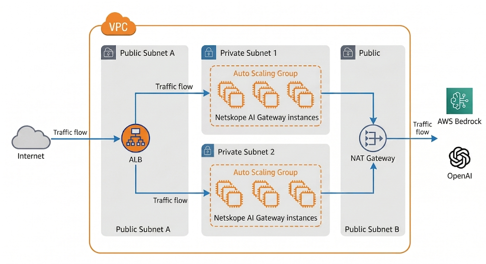

# Netskope AI Gateway — CloudFormation Reference Architecture

CloudFormation reference architecture for deploying [Netskope AI Gateway](https://docs.netskope.com/en/ai-gateway/)
together with [DLP On Demand](https://docs.netskope.com/en/data-loss-prevention-on-demand/) in a
single stack. A new VPC is created — no pre-existing networking is required. Both services are
configured, enrolled, and wired together before entering service, with no manual steps.



---

## Template Options

Three deployment templates are available. The combined template is recommended for most
deployments — the individual templates are alternatives when deploying only one service or
integrating into an existing environment.

| Template | File | Use when |
|---|---|---|
| **Combined** (this README) | `templates/gateway-combined.yaml` | Deploying AIG + DLP On Demand together — single stack, automatic wiring between services |
| **AI Gateway only** | `aig/template/gateway-aig.yaml` | Deploying AIG without DLP On Demand, or adding AIG into an existing VPC |
| **DLP On Demand only** | `dlpod/template/gateway-dlpod.yaml` | Deploying DLPoD as a standalone service, or before deploying AIG separately |

### Individual template documentation

| Document | Contents |
|---|---|
| [aig/docs/DEPLOYMENT.md](aig/docs/DEPLOYMENT.md) | AI Gateway-only: prerequisites, ACM cert, deploy options, verification |
| [aig/docs/OPERATIONS.md](aig/docs/OPERATIONS.md) | AI Gateway-only: enrollment flow, scaling, troubleshooting |
| [dlpod/docs/DEPLOYMENT.md](dlpod/docs/DEPLOYMENT.md) | DLP On Demand-only: prerequisites, Lambda artifacts, deploy options, verification |
| [dlpod/docs/OPERATIONS.md](dlpod/docs/OPERATIONS.md) | DLP On Demand-only: tethering flow, scaling, troubleshooting |

---

## Start Here

| I want to… | Go to |
|---|---|
| Deploy this quickly — I have my Netskope credentials ready | [QUICKSTART.md](docs/QUICKSTART.md) |
| Understand the VPC design, traffic flows, and HA architecture | [ARCHITECTURE.md](docs/ARCHITECTURE.md) |
| Review IAM roles, secrets handling, and encryption | [SECURITY.md](docs/SECURITY.md) |
| Deploy with full parameter documentation | [DEPLOYMENT.md](docs/DEPLOYMENT.md) |
| Operate a running deployment — scaling, monitoring, upgrades | [OPERATIONS.md](docs/OPERATIONS.md) |
| Diagnose a failing deployment or instance | [TROUBLESHOOTING.md](docs/TROUBLESHOOTING.md) |

---

## What This Provides

The AI Gateway sits inline between applications and LLM providers (Bedrock, OpenAI, etc.),
inspecting every prompt and response before it crosses the network boundary. Applications point
at the gateway's HTTPS endpoint and require no code changes — the gateway presents an
OpenAI-compatible API regardless of the upstream model.

**Controls applied to every request and response:**

| Control | What it enforces |
|---|---|
| **Data loss prevention** | Detects and blocks sensitive data in prompts and responses — PII, credentials, regulated content — using Netskope DLP policies. With DLP On Demand, content is scanned locally inside your VPC; no data leaves your AWS account for DLP processing. |
| **Prompt injection detection** | Identifies attempts to override system instructions or exfiltrate data through the model. Detection runs on the gateway using built-in rules; the optional advanced guardrails service adds a locally-hosted ML classifier for higher accuracy. |
| **Access control** | Enforces which applications and users can reach which models, based on Netskope policy. Requests that fail policy are rejected at the gateway before reaching the LLM provider. |
| **Rate limiting** | Caps request volume per application or user to control cost and prevent abuse. |
| **Audit logging** | Records all requests and responses — including blocked ones — to Netskope's management plane for visibility and compliance review. |

**Advanced guardrails (optional):** A GPU-backed Auto Scaling Group running Netskope's
`aisecurityllm` container provides ML-based prompt injection and content safety classification.
The model runs entirely within your VPC on NVIDIA GPU instances (g4dn or g5 family).

---

## How It Works

```
Internet → AI Gateway ALB (HTTPS:443)
               ↓
         AI Gateway instances (Auto Scaling Group, private subnets)
               ↓ DLP inspection
         DLP On Demand ALB (internal, dlp.aigw.internal)
               ↓
         DLP On Demand instances (Auto Scaling Group, private subnets)
```

At stack creation, a custom resource generates the DLP On Demand TLS certificate and writes both
the certificate and the DLP endpoint URL into the AI Gateway bootstrap configuration — before any
instances launch. When an AI Gateway instance starts, it reads its configuration from AWS Secrets
Manager, self-enrolls with the Netskope tenant, and begins forwarding content to DLP On Demand
immediately. No manual coordination between the two services is required.

---

## AWS Services Used

| Service | Purpose |
|---|---|
| **EC2** | AI Gateway and DLP On Demand instances |
| **Auto Scaling** | Instance lifecycle management with launch hooks for both services |
| **Elastic Load Balancing** | Internet-facing ALB (AI Gateway) and internal ALB (DLP On Demand) |
| **VPC** | Isolated network: public subnets (ALBs, NAT Gateway), private subnets (instances) |
| **Lambda** | AI Gateway activation/deregistration; DLP On Demand tethering steps; cert generation |
| **Step Functions** | Orchestrates DLP On Demand SSH-based tethering automation |
| **SNS** | Delivers Auto Scaling lifecycle events to Lambda functions |
| **Secrets Manager** | AI Gateway bootstrap secret, Netskope API credentials, DLP On Demand license key |
| **Systems Manager Parameter Store** | DLP On Demand ALB certificate PEM, AI Gateway appliance IDs |
| **ACM** | TLS certificates — auto-generated for both ALBs, or user-provided for the AI Gateway ALB |
| **Route 53** | Private hosted zone (`aigw.internal`) for DLP On Demand internal DNS |
| **CloudWatch Logs** | Lambda and instance log groups |
| **IAM** | Instance profiles, Lambda execution roles, lifecycle SNS publishing roles |
| **S3** | Lambda deployment packages and Lambda layer (paramiko/pyte) |

---

## IAM Requirements

The deploying IAM principal needs `CAPABILITY_NAMED_IAM` to create the IAM roles the stack
provisions. Required permissions:

| Service | Actions |
|---|---|
| CloudFormation | `cloudformation:*` |
| EC2 | `ec2:*` |
| Elastic Load Balancing | `elasticloadbalancing:*` |
| Auto Scaling | `autoscaling:*` |
| Lambda | `lambda:*` |
| Step Functions | `states:*` |
| SNS | `sns:*` |
| Secrets Manager | `secretsmanager:*` |
| SSM | `ssm:PutParameter`, `ssm:GetParameter`, `ssm:DeleteParameter`, `ssm:AddTagsToResource` |
| ACM | `acm:*` |
| Route 53 | `route53:*` |
| CloudWatch Logs | `logs:*` |
| IAM | `iam:CreateRole`, `iam:DeleteRole`, `iam:GetRole`, `iam:PutRolePolicy`, `iam:DeleteRolePolicy`, `iam:AttachRolePolicy`, `iam:DetachRolePolicy`, `iam:PassRole`, `iam:TagRole`, `iam:UntagRole`, `iam:CreateInstanceProfile`, `iam:DeleteInstanceProfile`, `iam:GetInstanceProfile`, `iam:AddRoleToInstanceProfile`, `iam:RemoveRoleFromInstanceProfile` |
| S3 (bucket) | `s3:CreateBucket`, `s3:ListBucket`, `s3:GetBucketLocation` on `arn:aws:s3:::netskope-aigw-templates-*` |
| S3 (objects) | `s3:GetObject`, `s3:PutObject` on `arn:aws:s3:::netskope-aigw-templates-*/*` |
| STS | `sts:GetCallerIdentity` |

<details>
<summary>IAM policy JSON (click to expand)</summary>

```json
{
  "Version": "2012-10-17",
  "Statement": [
    {
      "Sid": "CloudFormation",
      "Effect": "Allow",
      "Action": "cloudformation:*",
      "Resource": "*"
    },
    {
      "Sid": "EC2",
      "Effect": "Allow",
      "Action": "ec2:*",
      "Resource": "*"
    },
    {
      "Sid": "ELB",
      "Effect": "Allow",
      "Action": "elasticloadbalancing:*",
      "Resource": "*"
    },
    {
      "Sid": "AutoScaling",
      "Effect": "Allow",
      "Action": "autoscaling:*",
      "Resource": "*"
    },
    {
      "Sid": "Lambda",
      "Effect": "Allow",
      "Action": "lambda:*",
      "Resource": "*"
    },
    {
      "Sid": "StepFunctions",
      "Effect": "Allow",
      "Action": "states:*",
      "Resource": "*"
    },
    {
      "Sid": "IAM",
      "Effect": "Allow",
      "Action": [
        "iam:CreateRole",
        "iam:DeleteRole",
        "iam:GetRole",
        "iam:PutRolePolicy",
        "iam:DeleteRolePolicy",
        "iam:AttachRolePolicy",
        "iam:DetachRolePolicy",
        "iam:PassRole",
        "iam:TagRole",
        "iam:UntagRole",
        "iam:CreateInstanceProfile",
        "iam:DeleteInstanceProfile",
        "iam:GetInstanceProfile",
        "iam:AddRoleToInstanceProfile",
        "iam:RemoveRoleFromInstanceProfile"
      ],
      "Resource": "*"
    },
    {
      "Sid": "SecretsManager",
      "Effect": "Allow",
      "Action": "secretsmanager:*",
      "Resource": "*"
    },
    {
      "Sid": "SSM",
      "Effect": "Allow",
      "Action": [
        "ssm:PutParameter",
        "ssm:GetParameter",
        "ssm:DeleteParameter",
        "ssm:AddTagsToResource"
      ],
      "Resource": "*"
    },
    {
      "Sid": "SNS",
      "Effect": "Allow",
      "Action": "sns:*",
      "Resource": "*"
    },
    {
      "Sid": "Route53",
      "Effect": "Allow",
      "Action": "route53:*",
      "Resource": "*"
    },
    {
      "Sid": "ACM",
      "Effect": "Allow",
      "Action": "acm:*",
      "Resource": "*"
    },
    {
      "Sid": "CloudWatchLogs",
      "Effect": "Allow",
      "Action": "logs:*",
      "Resource": "*"
    },
    {
      "Sid": "S3Bucket",
      "Effect": "Allow",
      "Action": ["s3:CreateBucket", "s3:ListBucket", "s3:GetBucketLocation"],
      "Resource": "arn:aws:s3:::netskope-aigw-templates-*"
    },
    {
      "Sid": "S3Objects",
      "Effect": "Allow",
      "Action": ["s3:GetObject", "s3:PutObject"],
      "Resource": "arn:aws:s3:::netskope-aigw-templates-*/*"
    },
    {
      "Sid": "STS",
      "Effect": "Allow",
      "Action": "sts:GetCallerIdentity",
      "Resource": "*"
    }
  ]
}
```

</details>

> **Production hardening:** The `IAM` statement above uses `Resource: "*"`. For production
> deployments, scope it to your stack name prefix to prevent the deployer from creating roles
> outside the stack's scope:
> ```
> "Resource": [
>   "arn:aws:iam::*:role/<stack-prefix>-*",
>   "arn:aws:iam::*:instance-profile/<stack-prefix>-*"
> ]
> ```
> For example, if your stack name is `aigw-prod`, use `arn:aws:iam::*:role/aigw-prod-*`.

---

## Security Highlights

✅ **No secrets on instances** — API credentials never reach EC2 instances. The Activation Lambda
exchanges the token for a short-lived enrollment token, written to Secrets Manager. Instances
read only the bootstrap secret.

✅ **Instances in private subnets** — No public IP addresses on AI Gateway or DLP On Demand
instances. Inbound access is exclusively through load balancers.

✅ **Least-privilege IAM** — Nine dedicated IAM roles. Each role has only the permissions its
specific function requires.

✅ **Sensitive parameters masked** — `NetskopeApiToken` and `DlpodLicenseKey` use `NoEcho: true`
and are never shown in CloudFormation events or the console.

✅ **DLP runs inside your VPC** — Content sent to DLP On Demand for inspection never leaves your
AWS account.

✅ **All traffic encrypted** — External HTTPS via ACM, AIG→DLPoD HTTPS with ACM-imported cert,
Lambda→AWS services via TLS SDK.

⚠️ **Self-signed cert by default** — The auto-generated AIG ALB certificate causes browser
warnings. For production deployments, provide an ACM-issued certificate via `AcmCertificateArn`.
See [DEPLOYMENT.md — ACM Certificate](docs/DEPLOYMENT.md#4-acm-certificate-optional).

---

## Cost Estimate

Approximate monthly cost in us-west-1 (on-demand pricing, minimum deployment):

| Configuration | Estimated monthly cost |
|---|---|
| Minimum: 1 AIG (`m5.4xlarge`) + 1 DLPoD (`c5a.4xlarge`) | ~$1,070–$1,140 |
| Scaled: 4 AIG + 2 DLPoD (maximum defaults) | ~$3,200–$3,500 |
| + Advanced GPU guardrails (`g4dn.xlarge` per instance) | +~$380/instance/month |

AWS services (NAT Gateway, ALBs, Lambda, Secrets Manager, Route 53) add ~$80–$140/month.
Reserved Instances or Savings Plans reduce EC2 costs by 30–60% for steady workloads.

See [ARCHITECTURE.md — Cost Estimate](docs/ARCHITECTURE.md#cost-estimate) for a full breakdown.

---

## Documentation

| Document | Audience | Contents |
|---|---|---|
| [docs/QUICKSTART.md](docs/QUICKSTART.md) | Netskope customer / SE | Prerequisites checklist, three-step deploy, console alternative |
| [docs/ARCHITECTURE.md](docs/ARCHITECTURE.md) | AWS Architect | VPC design, traffic flows, IAM roles, HA, cost estimate, Well-Architected alignment |
| [docs/DEPLOYMENT.md](docs/DEPLOYMENT.md) | Customer / DevOps | Full prerequisites, parameter reference, deploy commands, verification steps |
| [docs/SECURITY.md](docs/SECURITY.md) | InfoSec | IAM least privilege, secrets handling, encryption, CFN security practices |
| [docs/OPERATIONS.md](docs/OPERATIONS.md) | DevOps Engineer | Startup sequence, scaling, monitoring, log groups, AMI upgrade |
| [docs/TROUBLESHOOTING.md](docs/TROUBLESHOOTING.md) | DevOps Engineer | Issue/Cause/Solution format with log patterns |
| [docs/Automated_Bootstrap_Using_AWS_Secrets_Manager.pdf](docs/Automated_Bootstrap_Using_AWS_Secrets_Manager.pdf) | Developer | AI Gateway bootstrap secret payload schema |

---

## Glossary

| Term | Definition |
|---|---|
| **Enrollment token** | One-time token generated by the Netskope API during appliance registration. Passed to the AI Gateway instance via Secrets Manager at boot. |
| **Tethering** | The process by which a DLP On Demand instance connects to the Netskope management plane to receive its configuration and license. |
| **Bootstrap secret** | AWS Secrets Manager secret read by the AI Gateway at boot. Contains the enrollment token and the DLP On Demand endpoint and certificate. |
| **Lifecycle hook** | Auto Scaling mechanism that holds an instance in a wait state while automation runs. AI Gateway hook timeout: 120 s. DLP On Demand hook timeout: 1800 s. |
| **Management plane** | Netskope's cloud-hosted control plane. Appliances register with it to receive security policies, configuration updates, and DLP profiles. |
| **nsadmin** | Default SSH user on both AI Gateway and DLP On Demand appliances. |

---

## Related Resources

- [Netskope AI Gateway Documentation](https://docs.netskope.com/en/ai-gateway/)
- [Deploy AI Gateway on Netskope Portal](https://docs.netskope.com/en/deploy-ai-gateway-on-netskope-portal/)
- [AI Gateway Sizing Guidelines](https://docs.netskope.com/en/ai-gateway-sizing-guidelines/)
- [DLP On Demand Documentation](https://docs.netskope.com/en/data-loss-prevention-on-demand/)
- [Netskope RBAC V3 Overview](https://docs.netskope.com/en/netskope-rbac-v3-overview/)
